<h3>
ISyE 6740 - Computational Statistics - Final Report
</h3>
Daniel Kim

#### 1. Problem Statement:

The objective is to implement multiple machine learning classification models, such as **K-nearest Neighbors (KNN)**, **Support Vector Machine (SVM)**, and most importantly **Convolutional Neural Networks (CNN)**, to classify whether histopathological scans contain tumor tissue or non-tumor tissue. Computer vision techniques can assist gastrointestinal oncologists in more precise medical imaging and diagnosis, thereby reducing costs for both patients and healthcare providers. Efficiently classifying histopathological scans can streamline decision-making and minimize errors in diagnostics. 

#### 2. Data Source:

The 5.8 gigabyte dataset of 11,977 histological scans is from Zenodo. The dataset consists of 3,977 images of adipose tissue and mucus (loose ADIMUC non-tumor tissue), 4,000 images of stroma and muscle (dense STRMUS non-tumor tissue), and 4,000 images of colorectal cancer and stomach cancer epithelial tissue (TUMSTU tumor tissue). Samples from each group are portrayed here. From left to right: ADIMUC, STRMUS, and TUMSTU histological scans.

<table>
    <tr>
        <td>
            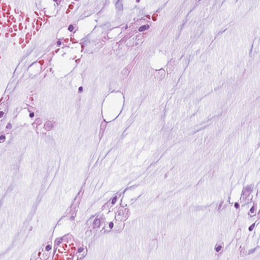</td>
        <td>
            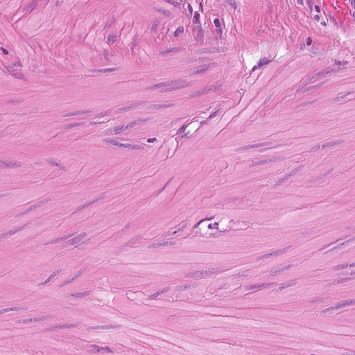</td>
        <td>
            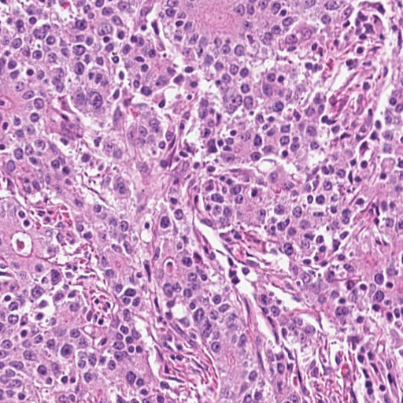</td>
    </tr>
</table>

Pre-processing steps have been undertaken: 

1. Each image is 512 x 512 pixels at a resolution of 0.5 µm/pixels

2. Patient scans are assigned as either ADIMUC, STRMUS, or TUMSTU.

3. To create a binary classification problem, both ADIMUC and STRMUS scans are grouped together as the non-cancer tissue class whereas TUMSTU scans are labeled as the cancer tissue class.

#### 3. Methodology:

The objective is to implement three classification algorithms (KNN, SVM, CNN) and select the best model based on their training and test classification metrics such as accuracy, recall, and AUC scores. The reasoning for selecting the aforementioned metrics is in 3.1 Metrics. Both training and test metrics are examined to determine each model's bias-variance trade-off and to observe whether a model is overfit or underfit to the training data. The data processing stage, highlighted in yellow, is different for each model due to different feature extraction/reduction techniques. For instance, PCA is applied in the data processing stage for sklearn's KNN to avoid the effects of the curse of high dimensionality. In the sklearn SVM modeling process, images are converted to histogram of gradients (HOGs) for feature reduction and for capturing high level spatial distributions in images. Lastly, Keras' CNN model has a data generator that resizes and rescales images. The methodology flow chart summarizes the start to finish modeling process.

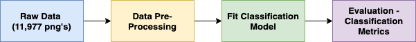

#### 3.1 Metrics:

**Cancer tissue scans will be the positive target class (1), and non-cancer tissue scans will be the non-target class (0)**. In this context, there are two types of misdiagnoses: type I (false positives) and type II (false negatives). Type I errors are patients who are predicted to have cancer but in reality they do not. Type II errors are patients who are predicted to not have cancer, but in reality they do. Type II errors are worse than Type I errors because incorrectly classified cancer patients may delay or fail to receive potential life-saving treatment. Delaying treatment for tumors reduces the probability of surviving. To reduce the number of type II (false negatives) errors, the **recall rate** will be the preferred classification metric to be optimized for.

**Accuracy** will be another metric to record the percentage of correct predictions for a given model.  

$$Accuracy = \frac{True Positive + True Negative}{True Positive + True Negative + False Positive + False Negative}$$

The **AUC score** will also be observed as a metric to determine a classifier's ability to properly distinguish the cancer tissue scans from the non-cancer tissue scans. The AUC score ranges between 0 and 1. An AUC equal to 1 indicates perfect separability between classes. A higher AUC value (0.5 < AUC < 1) indicates that a classifier is able to detect more True Positives and True Negatives than False Negatives and False Positives. An AUC value equal to 0.5 indicates that a classifier is randomly selecting a class, so there is not much separability between predictions.

$$0 \leq AUC \leq 1$$

#### 4. Modeling:

#### 4.1 - K-Nearest Neighbors (KNN):

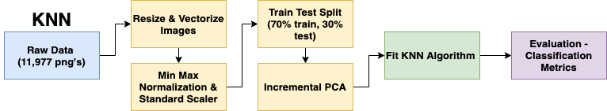

The KNN classification algorithm selects each training data point and classifies it according to the majority class of its closest k-nearest neighbors measured by the euclidean distance. To avoid the curse of high dimensionality, the image dataset is vectorized by resizing each image from 512 x 512 x 3 to 64 x 64 x 3 pixels, and then flattening each image to a 1-d array of 12,288 pixels. Images are then min-max normalized by dividing all data points by 255 so that the pixels are scaled to a range from 0 to 1. To prepare the data for PCA, images are then scaled and centered so that its distribution has a mean value of 0 and a standard deviation of 1. The dataset is then randomly partitioned into a 70% and 30% train test split where each train and test dataset has the same balance of cancer and non-cancer classes. Since each pixel is a feature, Sklearn's incremental PCA is then applied to the dataset for feature extraction by retrieving the top 10 components. As a result, the training dataset has 8,383 rows and 10 columns and the testing datset has 3,594 rows and 10 columns. Each row is a flattened and vectorized image, and each column is a PCA component. 

After gridsearching 12 different KNN models based on odd values of neighbors from 7 to 73, here are the train and test accuracy and recall rates:

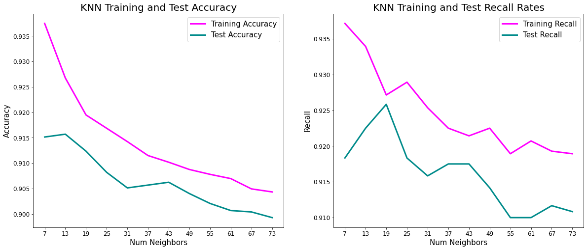

Not surprisingly, the model becomes less overfit as the number of neighbors increases. The train and test accuracy rates start to converge to around 90%. Here are the train and test metrics for the best KNN model (based on the best test recall rate) with 19 neighbors:

<table border="1" class="dataframe">
  <thead>
    <tr style="text-align: right;">
      <th></th>
      <th>Train Accuracy</th>
      <th>Test Accuracy</th>
      <th>Train Recall</th>
      <th>Test Recall</th>
      <th>Train AUC</th>
      <th>Test AUC</th>
    </tr>
  </thead>
  <tbody>
    <tr>
      <th>KNN - 19 Neighbors</th>
      <td>0.919</td>
      <td>0.912</td>
      <td>0.927</td>
      <td>0.926</td>
      <td>0.908</td>
      <td>0.916</td>
    </tr>
  </tbody>
</table>

#### 4.2 - Support Vector Machine (SVM):

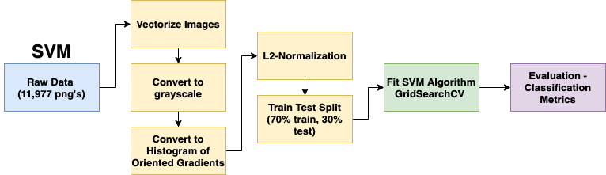

A Support Vector Machine algorithm attempts to classify data points by finding the optimal hyperplane in an N-dimensional space that has the maximum distance between data points of both classes. To prepare the dataset for image classification, images were converted to histogram of ordered gradients (HOGs). In HOGs, the distribution of gradients are used as features instead of individual pixels, which allows spatial distributions such as edges, outlines, and regions of color intensity changes to be captured. Images are first converted to grayscale (512 x 512 x 3 pixels to 512 x 512 pixels). Images are then divided into 12 by 12 pixel blocks, and for each block the magnitude and direction of the horizontal and vertical gradients are calculated. For each block, histogram of gradients are calculated as a vector of 9 bins corresponding to angles 0, 20, 40, 60, ..., 160. Blocks are then normalized and flattened to a feature vector. The dataset is then randomly partitioned into a 70% and 30% train test split where each train and test dataset has the same balance of cancer and non-cancer classes. As a result, the training dataset has 8,383 rows and 53,792 columns and the testing datset has 3,594 rows and 53,792 columns. By implementing sklearn's 5-fold cross validation GridsearchCV with a linear SVM, different levels of regularization C values and tolerance levels were implemented to find the optimal SVM model with C = 0.1 and tol = 0.001:

<table border="1" class="dataframe">
  <thead>
    <tr style="text-align: right;">
      <th></th>
      <th>Train Accuracy</th>
      <th>Test Accuracy</th>
      <th>Train Recall</th>
      <th>Test Recall</th>
      <th>Train AUC</th>
      <th>Test AUC</th>
    </tr>
  </thead>
  <tbody>
    <tr>
      <th>SVM </th>
      <td>1.00</td>
      <td>0.530</td>
      <td>1.00</td>
      <td>0.783</td>
      <td>1.00</td>
      <td>0.593</td>
    </tr>
  </tbody>
</table>

#### 4.3 - PCA Support Vector Machine (SVM):

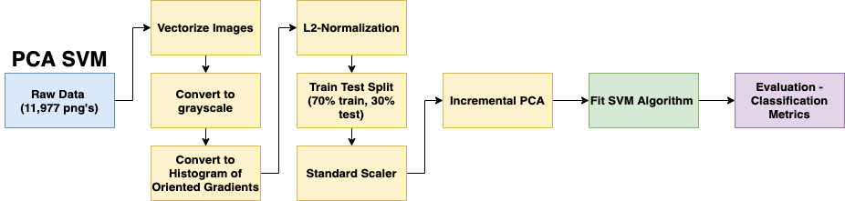

Not surprisingly, the HOG-SVM model is severely overfit due to the sheer number of 53,793 features. To mitigate the curse of high dimensionality, flattened histogram of oriented gradients are scaled so that the distribution has a mean value of 0 and a standard deviation of 1. Sklearn's IncrementalPCA was applied to reduce the dimensionality to 10 principal components. The same linear SVM model (C = 0.1, tol = 0.001) was then fit on the reduced dataset with more favorable results. The small difference between the train and test metrics shows that the model is able to generalize well to the test data.

<table border="1" class="dataframe">
  <thead>
    <tr style="text-align: right;">
      <th></th>
      <th>Train Accuracy</th>
      <th>Test Accuracy</th>
      <th>Train Recall</th>
      <th>Test Recall</th>
      <th>Train AUC</th>
      <th>Test AUC</th>
    </tr>
  </thead>
  <tbody>
    <tr>
      <th>PCA SVM</th>
      <td>0.814</td>
      <td>0.790</td>
      <td>0.856</td>
      <td>0.853</td>
      <td>0.824</td>
      <td>0.806</td>
    </tr>
  </tbody>
</table>

#### 4.3 - Convolutional Neural Network (CNN):

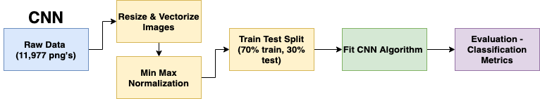

A CNN is popular in image recognition/classification tasks because it is able to capture both low-level and high-level features and spatial distribution in an image through its learnable filters. In the data processing stage, images are first resized from 512 x 512 x 3 to 224 x 224 x 3 pixels, and then min-max normalized by dividing all data points by 255 so that the pixels are scaled to a range from 0 to 1. The dataset is then randomly partitioned into a 70% and 30% train test split where each train and test dataset has the same balance of cancer and non-cancer classes. A 9-layer Keras CNN model using the Adam optimization algorithm was trained for 20 epochs with a batch size equal to 128 training examples. The following layers were implemented: 

**Conv2D Layer** is a set of learnable filters. Using the kernel filter, each filter transforms a part of the image to transform parts of the image. Essentially, the first Conv2D layer captures low-level features such as the images' edges, colors, and gradient orientation. 

**Max Pooling Layers** reduce the spatial size of the convolved features and returns the max value from the portion of the image covered by the kernel for three reasons:
1. Decrease the computation power to process the data by dimensionality reduction
2. Extract dominant features by training the model
3. Reduce noise

**Flatten Layer** converts all of the learned features from the previous convolutional layers to a format that can be used by the densely connected neural layer.

**Dense Layers** are used to generate the final prediction. It takes in the number of output nodes and has an activation function which we will use the sigmoid activation function. The values for the sigmoid range between 0 and 1 that allows the model to perform a binary classification. 

In summary, the model's robust performance in its train test accuracy, recall, and AUC scores are displayed here:

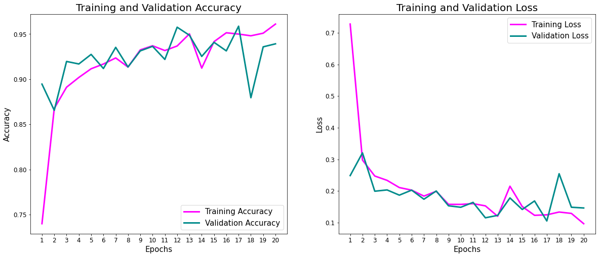

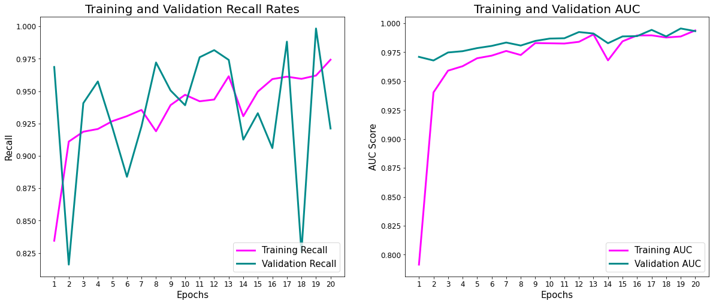

#### 5. Evaluation:

<table border="1" class="dataframe">
  <thead>
    <tr style="text-align: right;">
      <th></th>
      <th>Train Accuracy</th>
      <th>Test Accuracy</th>
      <th>Train Recall</th>
      <th>Test Recall</th>
      <th>Train AUC</th>
      <th>Test AUC</th>
    </tr>
  </thead>
  <tbody>
    <tr>
      <th>HOG SVM</th>
      <td>1.000</td>
      <td>0.530</td>
      <td>1.000</td>
      <td>0.783</td>
      <td>1.000</td>
      <td>0.593</td>
    </tr>
    <tr>
      <th>PCA HOG SVM</th>
      <td>0.814</td>
      <td>0.790</td>
      <td>0.856</td>
      <td>0.853</td>
      <td>0.825</td>
      <td>0.806</td>
    </tr>
    <tr>
      <th>KNN - 19 Neighbors</th>
      <td>0.919</td>
      <td>0.912</td>
      <td>0.927</td>
      <td>0.926</td>
      <td>0.908</td>
      <td>0.916</td>
    </tr>
    <tr>
      <th>CNN</th>
      <td>0.961</td>
      <td>0.939</td>
      <td>0.974</td>
      <td>0.921</td>
      <td>0.994</td>
      <td>0.993</td>
    </tr>
  </tbody>
</table>

The table above displays the train and test metrics for each classification model ranked from worst to best. HOG SVM performed the worst and was severely overfit due to the high number of features. PCA HOG SVM performed quite well, with close training and testing metric scores. The 10 principal components for the PCA HOG SVM model captured only 19% of the total explained variance. KNN performed surprisingly quite well and was quick to implement. The 10 principal components for KNN captured around 61% of the total explained variance. The CNN model performed the best, with high train and test accuracy, recall, and AUC scores. The 99% AUC score indicates the model's ability to correctly distinguish and separate non-cancer tissue from cancer tissue. Furthermore, the high test recall rate of 92.4% indicates that the CNN model has the lowest number of Type II (false negative) errors. However, due to the oscillating test recall rate over the number of epochs, it would be best to train the CNN model for more epochs.

#### 6. Conclusion:

In conclusion, 4 models were implemented: K-nearest neighbors with PCA, histogram of gradient linear support vector machine, HOG SVM with PCA, and a convolutional neural network. The convolutional neural network model performed the best out of the other machine learning models and has a high success rate in classifying cancer tissue scans from non-cancer tissue scans while reducing the number of false negatives. As a result, the intersection of machine learning and healthcare has tremendous potential and can aid both patients and doctors by improving diagnosis rates. In the future, it would be interesting to incorporate transfer learning by implementing pre-trained CNN models such as Resnet50. 

#### Sources:

[1] Zenodo Dataset - https://zenodo.org/record/2530789

[2] Classification Metrics - https://www.analyticsvidhya.com/blog/2020/09/precision-recall-machine-learning/

[3] AUC ROC - https://www.analyticsvidhya.com/blog/2020/06/auc-roc-curve-machine-learning/

[4] Incremental PCA - https://scikit-learn.org/stable/modules/generated/sklearn.decomposition.IncrementalPCA.html#sklearn.decomposition.IncrementalPCA

[5] HOG-SVM - https://kapernikov.com/tutorial-image-classification-with-scikit-learn/https://kapernikov.com/tutorial-image-classification-with-scikit-learn/

[6] Histogram of Oriented Gradients - https://www.learnopencv.com/histogram-of-oriented-gradients/

[7] Skicit-image HOG - https://scikit-image.org/docs/dev/api/skimage.feature.html#skimage.feature.hog

[8] Why do linear SVMS trained on HOG features perform so well? -  https://arxiv.org/pdf/1406.2419.pdf

[9] CNN Keras - https://missinglink.ai/guides/keras/using-keras-flatten-operation-cnn-models-code-examples/

[10] Incremental PCA - https://stackoverflow.com/questions/44334950/how-to-use-sklearns-incrementalpca-partial-fit

[11] Keras Image Data Preprocessing - https://keras.io/api/preprocessing/image/
